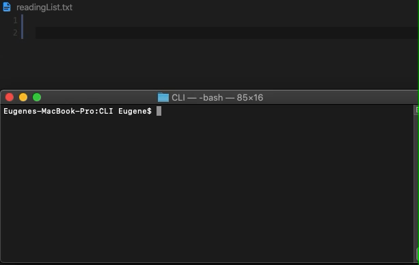

# BookCLI

Command line interface for query books from Google's Book API, then saving the query to a list.
Built with Commander.js and Inquirer.js. 


## Getting Started
All you need is to have node installed on your machine.

### Running the program

cd to the directory, and run with 

```
node commander.js
```

### Available Commands


```
node commander.js query or q <book title to query> - to query your book.
```
After a book is queried, you will be prompted with results, which then you can select with arrow keys and enter.

```
node commander.js open or o - to open your reading list
```
